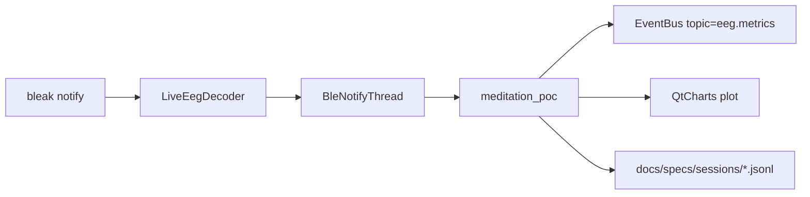

# EEG MVP — статус и архитектура (BrainLink Pro BLE)

Этот документ фиксирует **текущее рабочее состояние EEG‑части** NeuroSync Pro (ветка A, Windows) и точки расширения на будущее.

## Цели MVP, которые уже закрыты

- [x] **Live BLE поток** (BrainLink Pro, Nordic UART)
- [x] **Декод метрик** `attention/meditation` из BLE notify‑чанков (инкрементальный state‑machine)
- [x] **UI медитации** (фазы дыхания + метрики)
- [x] **Realtime график** Attention/Meditation + кнопка очистки
- [x] **Скан BLE в UI** (подключение без ручного ввода MAC)
- [x] **Логи сессий**: новый JSONL‑файл на сессию + выключатель записи
- [x] **Диагностика стабильности** в UI: таймер, Hz, last‑age, RSSI (из scan)

## Архитектура: поток данных



## Ключевые файлы

- **Парсер / декодер**: `src/neurosync_pro/eeg/protocol.py`, `src/neurosync_pro/eeg/live_decode.py`
- **BLE транспорт (async)**: `src/neurosync_pro/eeg/ble_stream.py`
- **Фоновые потоки UI**: `src/neurosync_pro/ui/ble_thread.py` (notify + scan)
- **UI медитации (PoC)**: `src/neurosync_pro/ui/meditation_poc.py`
- **CLI**: `src/neurosync_pro/cli.py` (`neurosync-pro meditation …`)

## Команды запуска (Windows)

Установка:

```bash
pip install -e ".[dev]"
pip install -e ".[gui]"
```

Запуск UI:

- **Скан → выбор устройства → Старт BLE**:

```bash
neurosync-pro meditation
```

- **Явный MAC (автостарт)**:

```bash
neurosync-pro meditation --ble-address "C0:E2:FC:2D:AC:10"
```

## Логи сессий

### 1) Авто‑сессии из UI

- Папка: `docs/specs/sessions/`
- Формат строки:
  - `type = "eeg"`
  - `timestamp_utc` (ISO8601)
  - `eeg.attention`, `eeg.meditation` (0..100)

### 2) Фиксированный файл из CLI

Если задан `--session-log`, UI пишет в него в режиме **append** (как явное решение пользователя) и кнопка «Новая сессия» отключена.

## Диагностика стабильности потока

В UI отображается строка:

- `⏱ mm:ss`: время сессии
- `X.X Hz`: оценка частоты метрик за последние 10 секунд
- `last X.Xs`: давность последней точки
- `RSSI -NN`: RSSI из BLE scan (если доступно)

Рекомендация для “здорового” потока:
- `last` обычно < 1–2 секунд
- Hz стабилен и не падает надолго к 0

## Что сознательно отложено (ветка B)

- COM↔BLE строгая сверка и параллельный захват (см. `docs/specs/handoff-todo.md`)

